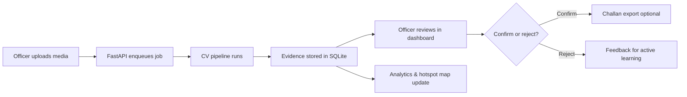
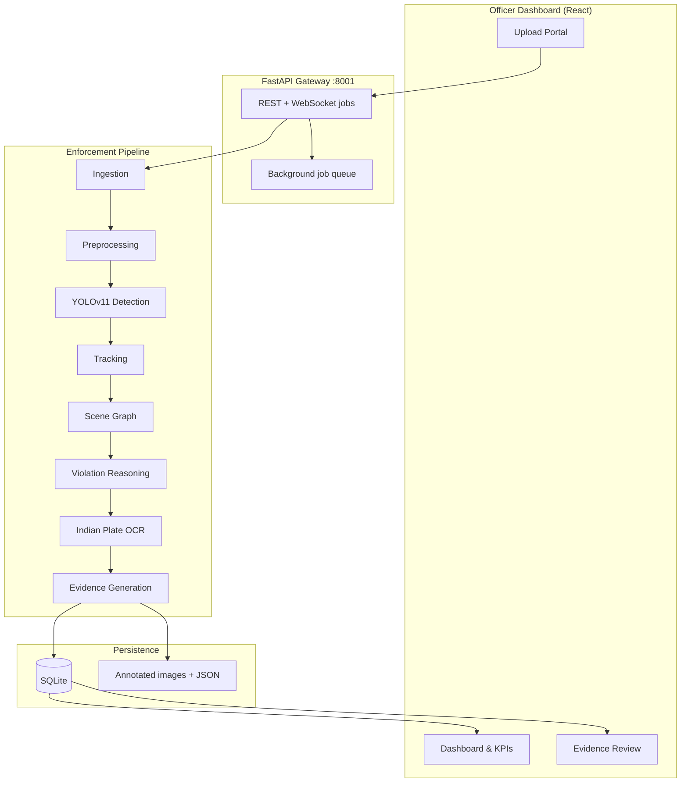

# Nigha AI

**Per-vehicle traffic enforcement for Indian cities.** Upload CCTV or traffic media, detect violations per vehicle (`VEH-001`, …), OCR Indian plates, and route explainable evidence to an officer review queue — AI proposes, humans decide.

> **Nigha AI — Scale enforcement without losing accountability.**

---

## Table of contents

1. [What problem this solves](#what-problem-this-solves)
2. [End-to-end flow (start to finish)](#end-to-end-flow-start-to-finish)
3. [Architecture](#architecture)
4. [Project structure](#project-structure)
5. [Prerequisites](#prerequisites)
6. [Local setup](#local-setup)
7. [Demo walkthrough (officer workflow)](#demo-walkthrough-officer-workflow)
8. [Enforcement pipeline](#enforcement-pipeline)
9. [API reference](#api-reference)
10. [Dashboard views](#dashboard-views)
11. [Configuration](#configuration)
12. [Running tests](#running-tests)
13. [Deployment](#deployment)
14. [Related documents](#related-documents)

---

## What problem this solves

Indian cities generate huge volumes of traffic footage every day, but police cannot manually review all of it. Naive “AI challan” tools also fail because they label whole images instead of answering:

1. **Which vehicle** broke the rule?
2. **What rule** was broken, and **why**?
3. **Can an officer defend** this in a dispute?

Nigha AI processes each vehicle separately, attaches explainable evidence (plate, violation type, confidence, bounding boxes), and routes cases to an officer review queue before any challan is issued.

---

## End-to-end flow (start to finish)

This is the full journey from a traffic image to a reviewable enforcement decision.



| Step | What happens | Where |
|------|----------------|-------|
| **1. Upload** | Officer selects image/video, sets Bengaluru GPS + scene rules | Dashboard → **Upload** tab |
| **2. Ingest** | File saved, media record created | `services/ingestion` |
| **3. Process** | Detect → track → associate → reason → OCR → annotate | `services/pipeline.py` |
| **4. Store** | Per-vehicle evidence rows + annotated image + JSON | `data/evidence/`, SQLite |
| **5. Review** | Officer confirms or rejects each case | Dashboard → **Evidence** tab |
| **6. Act** | Confirmed cases can export challan receipt | `services/challan/` |
| **7. Analyze** | Trends, hotspots, repeat offenders refresh | Dashboard → **Dashboard** / **Mobility** |

Example output (not a black-box label):

```
VEH-001 · helmet non-compliance · 82% confidence · officer confirmed
Plate: KA01AB1234 · Camera: CAM_BLR_MG_01 · MG Road Junction
```

---

## Architecture



### Tech stack

| Layer | Technology |
|-------|------------|
| Frontend | React 18, Vite, Tailwind CSS, Recharts, Leaflet, Framer Motion |
| API | FastAPI, Uvicorn (port **8001**) |
| CV / ML | Ultralytics YOLOv11, OpenCV, EasyOCR |
| Database | SQLite + SQLAlchemy |
| Dev frontend | Vite (port **5173**), proxies `/api` → backend |

---

## Project structure

```
flipkart gridlock_cursor/
├── api/main.py                 # FastAPI routes & middleware
├── config.py                   # Settings (TV_* env vars)
├── run_server.py               # Start backend
├── schemas.py                  # Pydantic request/response models
├── services/
│   ├── pipeline.py             # End-to-end orchestrator
│   ├── ingestion/              # Upload & RTSP intake
│   ├── preprocessing/          # CLAHE, blur/quality gate
│   ├── detection/              # YOLOv11 + NMS
│   ├── tracking/               # IoU tracker (video)
│   ├── association/            # Scene graph — VEH IDs, rider links
│   ├── violation_reasoning/    # Per-vehicle rules engine
│   ├── ocr/                    # Indian plate OCR + validation
│   ├── evidence/               # Annotation + JSON export
│   ├── analytics/              # Dashboard aggregates & mobility
│   ├── challan/                # Receipt export & penalties
│   ├── review/                 # Confidence-tier routing
│   └── security/               # Optional JWT / API key auth
├── db/                         # SQLAlchemy models & database
├── frontend/                   # React officer dashboard
│   └── src/
│       ├── components/         # Dashboard, Evidence, Upload views
│       ├── config/city.js      # Bengaluru map & camera zones
│       └── api.js              # API client
├── CONTEXT/                    # Enforcement spec & violation rules
├── tests/                      # 70 automated tests
├── data/                       # SQLite DB + evidence artifacts (gitignored)
├── Dockerfile                  # Render / Docker deployment
├── render.yaml                 # Render Blueprint (API + frontend)
└── SOLUTION.md                 # Full solution & roadmap document
```

---

## Prerequisites

- **Python** 3.10+ (3.11 recommended for production)
- **Node.js** 18+
- **~2 GB RAM** for YOLO + EasyOCR on CPU (first model load takes 1–2 minutes)

---

## Local setup

### 1. Clone and create a virtual environment

```bash
git clone <your-repo-url>
cd flipkart gridlock_cursor
python -m venv .venv
```

**Windows (PowerShell)**

```powershell
.\.venv\Scripts\Activate.ps1
pip install -r requirements.txt
```

**macOS / Linux**

```bash
source .venv/bin/activate
pip install -r requirements.txt
```

### 2. Start the backend

```bash
python run_server.py
```

- API: **http://localhost:8001**
- Interactive docs: **http://localhost:8001/docs**
- Health check: **http://localhost:8001/health** — wait for `"models_ready": true` before uploading

On first startup, YOLO and OCR models load in the background. The dashboard shows a “warming up” state until ready.

### 3. Start the frontend (second terminal)

```bash
cd frontend
npm install
npm run dev
```

- Dashboard: **http://localhost:5173**
- Vite proxies `/api` and `/health` to port **8001** — keep both processes running.

### Windows shortcut

Double-click or run from the project root:

```cmd
start.bat
```

This opens two windows: API on **8001** and dashboard on **5173**.

---

## Demo walkthrough (officer workflow)

Follow this sequence to exercise the full system locally.

### Step 1 — Open the dashboard

Go to **http://localhost:5173**. Confirm the sidebar shows **Backend connected** and models are ready.

### Step 2 — Upload traffic media

1. Open the **Upload** tab.
2. Choose a traffic image or short video (JPEG/PNG/MP4).
3. Location defaults to **Bengaluru** (`CAM_BLR_MG_01`, MG Road Junction).
4. Optionally expand **Advanced scene rules**:
   - `legal_direction_angle` — expected traffic flow (wrong-side detection)
   - `no_parking_zones` — pixel rectangles `[[x1,y1,x2,y2], ...]`
   - `stop_line_y` + `signal_state` — red-light / stop-line violations
5. Click **Analyze**. A 3-step progress indicator tracks the job.

### Step 3 — Wait for processing

The pipeline runs asynchronously:

1. **Ingestion** — file saved with camera metadata
2. **Preprocessing** — quality check, CLAHE normalization
3. **Detection** — vehicles, persons, signals (YOLOv11)
4. **Association** — links riders, helmets, plates to `VEH-001`, `VEH-002`, …
5. **Violation reasoning** — per-vehicle rules with confidence + reason text
6. **OCR** — Indian plate format validation (e.g. `KA01AB1234`)
7. **Evidence** — annotated image (green = compliant, red = violation) + JSON

When complete, you are redirected to the **Evidence** tab.

### Step 4 — Review evidence

1. Filter by plate, violation type, or review status.
2. Select a case in the list — annotated image and details appear on the right.
3. **Confirm** (`C`) or **Reject** (`R`) using buttons or keyboard shortcuts.
4. Confirmed violations can export a challan receipt.

### Step 5 — Check analytics

Return to **Dashboard**:

- KPI cards (total violations, pending review, confirmed)
- Violation trends (area chart) and breakdown (donut chart)
- **Bengaluru hotspot map** — violation clusters by camera
- **Review queue** widget — jump back to pending cases

Open **Mobility** for congestion snapshots and traffic-flow analytics.

---

## Enforcement pipeline

| Stage | Module | Output |
|-------|--------|--------|
| 1. Ingestion | `services/ingestion` | Media record with lat/lng, `camera_id`, timestamp |
| 2. Preprocessing | `services/preprocessing` | Quality score; reject blurry frames |
| 3. Detection | `services/detection` | Instance bboxes: vehicles, persons, signals |
| 4. Tracking | `services/tracking` | Stable track IDs across video frames |
| 5. Association | `services/association` | Scene graph: rider→vehicle, helmet→rider |
| 6. Violation reasoning | `services/violation_reasoning` | Per-vehicle violations with reason + confidence |
| 7. OCR | `services/ocr` | Plate text, Indian format validation |
| 8. Evidence | `services/evidence` | Annotated image + `{media_id}_enforcement.json` |

### Supported violation types

| Type | Rule basis |
|------|------------|
| `helmet_non_compliance` | Rider head ROI — helmet score below threshold |
| `triple_riding` | More than 2 persons on one motorcycle |
| `wrong_side_driving` | Vehicle motion vs. `legal_direction_angle` |
| `illegal_parking` | Vehicle bbox inside no-parking zone |
| `seatbelt_non_compliance` | Driver torso ROI analysis |
| `stop_line_violation` | Vehicle past stop line when signal is red |
| `red_light_violation` | Signal state + stop-line geometry |

### Review workflow states

| Status | Meaning |
|--------|---------|
| `pending_review` | AI proposal awaiting officer action |
| `confirmed` | Officer approved — eligible for challan export |
| `rejected` | Officer dismissed — feeds active learning |
| `auto_cleared` | Low confidence / no violation |

---

## API reference

Base URL: `http://localhost:8001` (local) or your deployed API origin.

| Method | Endpoint | Description |
|--------|----------|-------------|
| GET | `/health` | App status, feature flags, `models_ready` |
| POST | `/api/v1/media/upload` | Upload image/video + scene config |
| POST | `/api/v1/media/rtsp` | Capture frame from RTSP stream |
| GET | `/api/v1/jobs/{job_id}` | Job status & enforcement result |
| WS | `/api/v1/ws/jobs/{job_id}` | Real-time job progress events |
| GET | `/api/v1/evidence` | Search / filter evidence |
| PATCH | `/api/v1/evidence/{id}/review` | Confirm or reject |
| POST | `/api/v1/evidence/{id}/export-challan` | Generate challan receipt |
| GET | `/api/v1/analytics/summary` | Dashboard KPIs & trends |
| GET | `/api/v1/analytics/mobility` | Congestion & mobility metrics |
| GET | `/api/v1/metrics` | Latency p50/p95, throughput |
| GET | `/api/v1/feedback/stats` | Rejection feedback aggregates |

Full interactive documentation: **http://localhost:8001/docs**

---

## Dashboard views

| Tab | Purpose |
|-----|---------|
| **Dashboard** | KPIs, violation trends, Bengaluru hotspot map, review queue |
| **Mobility** | Congestion classification and traffic-flow analytics |
| **Upload** | Media upload with progressive scene-rule disclosure |
| **Evidence** | Master-detail review — filter chips, keyboard shortcuts |

Pilot city configuration (camera zones, map bounds) lives in `frontend/src/config/city.js`.

| Zone | Camera ID | Approx. location |
|------|-----------|------------------|
| MG Road | `CAM_BLR_MG_01` | 12.9750, 77.6063 |
| Silk Board | `CAM_BLR_SILK_01` | 12.9176, 77.6234 |
| Hebbal Flyover | `CAM_BLR_HEBBAL_01` | 13.0358, 77.5970 |
| Electronic City | `CAM_BLR_ECITY_01` | 12.8399, 77.6770 |
| Indiranagar | `CAM_BLR_INDIRA_01` | 12.9784, 77.6408 |

---

## Configuration

Settings use the `TV_` prefix. Common variables:

| Variable | Default | Description |
|----------|---------|-------------|
| `TV_API_PORT` | `8001` | API listen port |
| `TV_WARMUP_ENABLED` | `true` | Preload models on startup |
| `TV_WARMUP_BLOCKING` | `true` (local), `false` (Docker) | Block until models ready |
| `TV_USE_HELMET_YOLO` | `true` (local), `false` (Render) | Dedicated helmet YOLO weights |
| `TV_AUTH_ENABLED` | `false` | Enable JWT / API key auth |
| `TV_DATABASE_URL` | *(empty)* | PostgreSQL URL; empty = SQLite |
| `TV_REDIS_URL` | *(empty)* | Redis for distributed job queue |
| `VITE_API_URL` | *(empty)* | Frontend API origin (set on Vercel/Render) |

Evidence and uploads are stored under `data/` (created automatically on first run).

---

## Running tests

```bash
# From project root with venv activated
python -m pytest
```

The suite includes **70 tests** covering the pipeline, violations, OCR, API routes, evidence review, challan export, and security.

---

## Deployment

### Render (recommended — included blueprint)

The repo ships `render.yaml` and a `Dockerfile` for the ML backend.

1. Go to [render.com](https://render.com) → **New** → **Blueprint**
2. Connect your GitHub repo
3. Apply the blueprint — creates **nigha-ai-api** (Docker) + **nigha-ai-frontend** (static)
4. Wait for the API build (~10–15 min first time)
5. Verify: `https://<your-api>.onrender.com/health` → `"models_ready": true`
6. Open the frontend URL Render provides

**Notes:**

- API needs **Standard** plan (2 GB RAM) in `render.yaml` for YOLO + EasyOCR; Starter (512 MB) will OOM.
- `VITE_API_URL` is wired automatically from the API service URL.

### Vercel + ngrok (live demo from laptop)

For demos where the API runs on your machine:

1. `python run_server.py`
2. `ngrok http 8001`
3. Deploy frontend to Vercel with `VITE_API_URL=https://<your-ngrok-url>`

See `DEPLOY_LIVE.md` for current demo URLs and rebuild steps.

### Docker (API only)

```bash
docker build -t nigha-ai-api .
docker run -p 8001:10000 -e PORT=10000 nigha-ai-api
```

---

## Related documents

| Document | Contents |
|----------|----------|
| [`SOLUTION.md`](SOLUTION.md) | Full solution write-up, differentiation, roadmap |
| [`CONTEXT/enforcement_spec.md`](CONTEXT/enforcement_spec.md) | Behavior contract for enforcement output |
| [`CONTEXT/violation_rules.yaml`](CONTEXT/violation_rules.yaml) | Violation rule definitions |
| [`DEPLOY_LIVE.md`](DEPLOY_LIVE.md) | Live demo URLs (Vercel + ngrok) |

---

## Summary

**Nigha AI** bridges scalable computer vision and accountable traffic enforcement. Every violation binds to a specific vehicle, ships with explainable evidence, and passes through human officer review — designed to move Indian cities from AI demos to defensible enforcement at scale, starting with **Bengaluru**.
