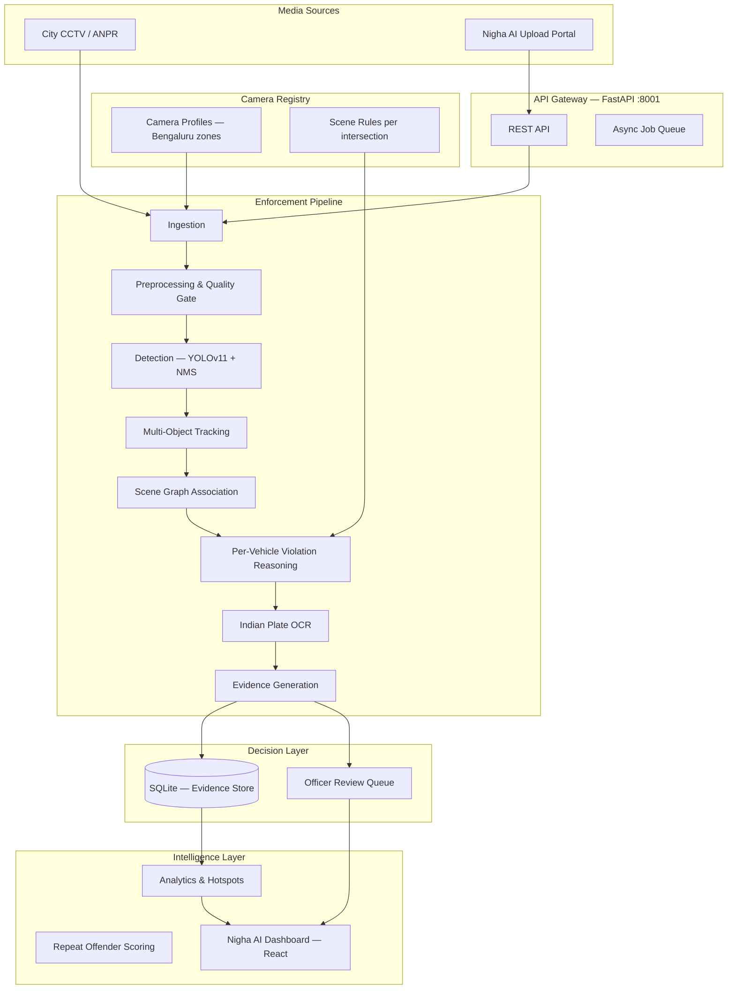
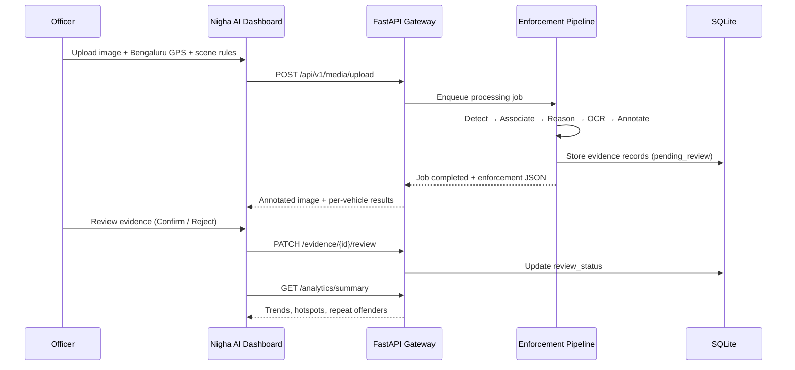
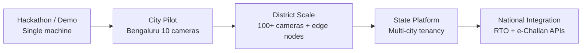

# Nigha AI — Solution Document

**Automated Per-Vehicle Traffic Enforcement Platform**  
*AI proposes. Officers decide. Every violation is attributable, explainable, and auditable.*

**Deployment target:** Bengaluru (Bangalore) city operations  
**Version:** 1.0 · Hackathon / Pilot-ready

---

## Table of Contents

1. [Problem We Are Solving](#1-problem-we-are-solving)
2. [Our Solution](#2-our-solution)
3. [Approach & Design Philosophy](#3-approach--design-philosophy)
4. [Detailed System Architecture](#4-detailed-system-architecture)
5. [Enforcement Pipeline (Deep Dive)](#5-enforcement-pipeline-deep-dive)
6. [Data Model & Evidence Contract](#6-data-model--evidence-contract)
7. [Officer Dashboard (Nigha AI UI)](#7-officer-dashboard-nigha-ai-ui)
8. [Bangalore City Configuration](#8-bangalore-city-configuration)
9. [What Is Built Today](#9-what-is-built-today)
10. [Differentiation vs Typical CV Demos](#10-differentiation-vs-typical-cv-demos)
11. [Future Features Roadmap](#11-future-features-roadmap)
12. [Deployment & Scale Path](#12-deployment--scale-path)

---

## 1. Problem We Are Solving

Indian cities generate **millions of traffic frames per day** from CCTV, ANPR cameras, and mobile enforcement — but manual inspection cannot scale. At the same time, naive "AI challan" systems fail in production because:

| Challenge | Why it blocks real enforcement |
|-----------|-------------------------------|
| **Scale vs. officers** | Violations vastly outnumber traffic police available to review footage |
| **Image-level AI is legally weak** | A frame-level label cannot answer *which vehicle* broke the law |
| **Disputes need proof** | Challans require plate, reason, confidence, spatial bbox, and audit trail |
| **Scene diversity** | Stop lines, signal state, parking zones, and flow direction differ per camera |
| **India-specific violations** | Helmet, triple riding, wrong-side driving, Indian plate formats dominate |
| **Trust & accountability** | Fully automated penalties without human review erode public and legal trust |

### The three questions every enforcement system must answer

1. **Which vehicle** broke the rule?  
2. **What rule** was broken, and **why**?  
3. **Can an officer defend** this decision in a dispute?

Most computer-vision demos answer none of these reliably. **Nigha AI** is built to answer all three.

---

## 2. Our Solution

**Nigha AI** (*nigha* — vision/watchfulness) is a **per-vehicle traffic enforcement decision-support platform**. It does not issue penalties autonomously. It:

1. Ingests CCTV / uploaded traffic media with **camera location and scene rules**
2. Builds a **scene graph** linking vehicles, riders, helmets, plates, and signals
3. Runs **per-vehicle violation reasoning** (never whole-image classification)
4. Packages **explainable evidence** (annotated image + structured JSON)
5. Routes high-impact cases to an **officer review queue**
6. Surfaces **city analytics** — hotspots, trends, repeat offenders — on a modern dashboard

### One-line pitch

> We don't classify images — we build **attributable, reviewable enforcement decisions** for every vehicle in the scene.

### Example output (not "AI caught a violation")

```
VEH-001 · helmet non-compliance · 82% confidence · officer confirmed
Plate: KA01AB1234 · Camera: CAM_BLR_MG_01 · MG Road Junction
```

---

## 3. Approach & Design Philosophy

Six principles govern every architectural decision:

| # | Principle | How Nigha AI implements it |
|---|-----------|---------------------------|
| 1 | **Instance-level, never global** | Every violation binds to exactly one `vehicle_id` (`VEH-001`, `VEH-002`, …) |
| 2 | **Explainability by default** | Each violation carries `reason`, `confidence`, `evidence_bboxes`, annotated proof |
| 3 | **Scene-configurable rules** | Per-camera: direction angle, no-parking zones, stop line, signal state |
| 4 | **Human accountability** | AI proposes → officer confirms or rejects before any enforcement action |
| 5 | **Staged intelligence** | Heuristic → fine-tuned model → ensemble; platform architecture stays constant |
| 6 | **Continuous improvement** | Officer decisions feed an active-learning loop (roadmap) |

**Core stance:** Enforcement is a **decision-support system**, not an autonomous penalty engine.

---

## 4. Detailed System Architecture

### 4.1 High-level architecture



### 4.2 Request flow (upload → review)



### 4.3 Technology stack

| Layer | Technology |
|-------|------------|
| **Frontend** | React 18, Vite, Tailwind CSS, Recharts, Leaflet, Framer Motion |
| **API** | FastAPI, Uvicorn (port **8001**) |
| **CV / ML** | Ultralytics YOLOv11, OpenCV, EasyOCR |
| **Database** | SQLite + SQLAlchemy |
| **Evidence files** | Annotated images + `{media_id}_enforcement.json` |
| **Dev frontend** | Vite dev server (port **5173**), proxies `/api` → backend |

### 4.4 Project structure

```
flipkart gridlock_cursor/
├── api/main.py                 # FastAPI gateway & routes
├── config.py                   # App name, DB path, settings
├── run_server.py               # Start backend
├── services/
│   ├── pipeline.py             # Orchestrator
│   ├── ingestion/              # Media intake
│   ├── preprocessing/          # CLAHE, quality scoring
│   ├── detection/              # YOLOv11 + NMS
│   ├── tracking/               # IoU tracker (video)
│   ├── association/            # Scene graph — VEH IDs, rider links
│   ├── violation_reasoning/    # Per-vehicle rules engine
│   ├── ocr/                    # Indian plate OCR + validation
│   ├── evidence/               # Annotation + JSON export
│   └── analytics/              # Dashboard aggregates
├── db/                         # SQLAlchemy models
├── frontend/                   # Nigha AI React dashboard
│   ├── public/nigha-logo.png
│   └── src/
│       ├── components/         # Dashboard, Evidence, Upload views
│       └── config/city.js        # Bengaluru map & camera zones
├── CONTEXT/enforcement_spec.md   # Behavior contract
├── data/                       # SQLite DB + evidence artifacts
└── tests/                      # 35+ unit & API tests
```

---

## 5. Enforcement Pipeline (Deep Dive)

### Stage-by-stage processing

| Stage | Module | Output |
|-------|--------|--------|
| **1. Ingestion** | `services/ingestion` | Media record with lat/lng, `camera_id`, timestamp |
| **2. Preprocessing** | `services/preprocessing` | Quality score, CLAHE normalization, reject low-quality frames |
| **3. Detection** | `services/detection` | Instance bboxes: vehicles, persons, signals (YOLO + NMS) |
| **4. Tracking** | `services/tracking` | Stable track IDs across video frames |
| **5. Association** | `services/association` | Scene graph: `VEH-001+`, rider→vehicle, helmet→rider |
| **6. Violation reasoning** | `services/violation_reasoning` | Per-vehicle violations with reason + confidence |
| **7. OCR** | `services/ocr` | Plate text, Indian format validation, normalization |
| **8. Evidence** | `services/evidence` | Annotated image (green=compliant, red=violation) + JSON |

### Supported violation types (India-focused)

| Type | Rule basis |
|------|------------|
| `helmet_non_compliance` | Rider head ROI — helmet shell score below threshold |
| `triple_riding` | More than 2 persons associated to one motorcycle |
| `wrong_side_driving` | Vehicle motion vs. `legal_direction_angle` |
| `illegal_parking` | Vehicle bbox inside configured no-parking zone |
| `seatbelt_non_compliance` | Driver torso ROI analysis |
| `stop_line_violation` | Vehicle past `stop_line_y` when `signal_state=red` |
| `red_light_violation` | Signal state + stop-line geometry |

### Scene configuration (per upload / per camera)

| Parameter | Purpose |
|-----------|---------|
| `latitude` / `longitude` | Hotspot map pin (Bengaluru coordinates) |
| `camera_id` | e.g. `CAM_BLR_MG_01` |
| `legal_direction_angle` | Expected traffic flow (wrong-side detection) |
| `no_parking_zones` | JSON `[[x1,y1,x2,y2], ...]` pixel rectangles |
| `stop_line_y` | Stop line Y-coordinate in frame |
| `traffic_light_state` / `signal_state` | `red` / `green` / `unknown` |

---

## 6. Data Model & Evidence Contract

### Per-vehicle enforcement JSON (authoritative schema)

```json
{
  "media_id": "uuid",
  "job_id": "uuid",
  "timestamp": "ISO-8601",
  "vehicles": [
    {
      "vehicle_id": "VEH-001",
      "vehicle_type": "motorcycle",
      "bounding_box": [x1, y1, x2, y2],
      "license_plate": {
        "plate_normalized": "KA01AB1234",
        "plate_valid": true
      },
      "associated_persons": [
        { "person_id": "P-001", "role": "rider", "helmet_detected": false }
      ],
      "rider_count": 1,
      "violations": [
        {
          "type": "helmet_non_compliance",
          "confidence": 0.82,
          "reason": "No helmet detected on rider (helmet score: 0.20, need >= 0.42)"
        }
      ],
      "compliance_status": "violation",
      "confidence": 0.82
    }
  ],
  "annotated_path": "data/evidence/..._annotated.jpg"
}
```

### Review workflow states

| Status | Meaning |
|--------|---------|
| `pending_review` | AI proposal awaiting officer action |
| `confirmed` | Officer approved — eligible for challan export |
| `rejected` | Officer dismissed — feeds active learning |
| `auto_cleared` | System cleared (low confidence / no violation) |

### Analytics aggregates (dashboard API)

- `total_violations`, `by_type`, `by_review_status`
- `daily_trends` — time-series for area chart
- `hotspots` — lat/lng clusters by camera
- `repeat_offenders` — plate-level risk scoring (30-day window)

---

## 7. Officer Dashboard (Nigha AI UI)

Modern **light-mode green & white** interface designed for city traffic operations.

### Views

| Tab | Purpose |
|-----|---------|
| **Dashboard** | KPIs, violation trends, donut chart, Bengaluru hotspot map, officer review queue |
| **Upload** | Media upload with 3-step progress, progressive scene-rule disclosure |
| **Evidence** | Master-detail review pane — filter chips, keyboard shortcuts (`C` confirm, `R` reject) |

### Key UX decisions

- **Pending review CTA** on dashboard — surfaces actionable queue immediately
- **Per-vehicle results** after upload — not a single frame-level label
- **Bengaluru map** locked to city bounds with intensity legend
- **Semantic colors** — green confirmed, amber pending, red critical/degraded
- **Nigha AI branding** — custom shield logo, Bengaluru · MG Road Junction context

---

## 8. Bangalore City Configuration

Pilot deployment is configured for **Bengaluru (Bangalore)**:

| Zone | Camera ID | Approx. location |
|------|-----------|------------------|
| MG Road | `CAM_BLR_MG_01` | 12.9750, 77.6063 |
| Silk Board | `CAM_BLR_SILK_01` | 12.9176, 77.6234 |
| Hebbal Flyover | `CAM_BLR_HEBBAL_01` | 13.0358, 77.5970 |
| Electronic City | `CAM_BLR_ECITY_01` | 12.8399, 77.6770 |
| Indiranagar | `CAM_BLR_INDIRA_01` | 12.9784, 77.6408 |

Configuration lives in `frontend/src/config/city.js`. Legacy Hyderabad coordinates in stored data are automatically remapped to Bengaluru zones for map display.

---

## 9. What Is Built Today

### Backend (production-oriented prototype)

- [x] FastAPI gateway with health, upload, jobs, evidence, analytics, metrics
- [x] Full modular CV pipeline (ingestion → evidence)
- [x] Per-vehicle enforcement JSON contract
- [x] 7 violation types with scene-configurable rules
- [x] Indian plate OCR + format validation
- [x] SQLite persistence + evidence search/filter
- [x] Officer review API (confirm/reject)
- [x] Analytics: trends, hotspots, repeat offenders, system metrics
- [x] 35+ automated tests

### Frontend (demo-ready)

- [x] Nigha AI branded dashboard (light green/white theme)
- [x] Sidebar navigation + mobile bottom tabs
- [x] KPI cards with count-up animation, area + donut charts
- [x] Bengaluru Leaflet hotspot map
- [x] Officer review queue widget
- [x] Master-detail evidence review with keyboard shortcuts
- [x] Upload stepper with advanced scene rules accordion
- [x] Loading skeletons, empty states, responsive layout

### API endpoints

| Method | Endpoint | Description |
|--------|----------|-------------|
| GET | `/health` | App status (`Nigha AI`) |
| POST | `/api/v1/media/upload` | Upload & process media |
| GET | `/api/v1/jobs/{job_id}` | Job status & enforcement result |
| GET | `/api/v1/evidence` | Search / filter evidence |
| PATCH | `/api/v1/evidence/{id}/review` | Confirm or reject |
| GET | `/api/v1/analytics/summary` | Dashboard data |
| GET | `/api/v1/metrics` | Latency p50/p95, throughput |

---

## 10. Differentiation vs Typical CV Demos

| Dimension | Typical CV demo | Nigha AI |
|-----------|----------------|----------|
| Unit of enforcement | Whole image / frame | **Per vehicle** (`VEH-001`) |
| Legal defensibility | Black-box class label | Reason + confidence + bbox + audit trail |
| Human oversight | None or cosmetic | **Officer review queue** — confirm/reject required |
| Scene adaptability | Hardcoded rules | Per-camera zones, angles, signals |
| India violations | Generic "traffic violation" | Helmet, triple riding, wrong-side, Indian plates |
| Output | Screenshot | Annotated evidence + structured JSON + DB record |
| City ops | Static chart | Bengaluru hotspot map, repeat offenders, trends |

---

## 11. Future Features Roadmap

### Phase 1 — Pilot hardening (0–3 months)

| Feature | Description |
|---------|-------------|
| **Live CCTV ingest** | RTSP stream connector replacing manual upload |
| **Camera registry UI** | Admin panel to register cameras, calibrate homography, draw zones on map |
| **Confidence tier routing** | Auto-clear low-confidence; fast-track high-confidence to review |
| **Batch review** | Select multiple evidence items → confirm/reject in one action |
| **Challan export** | Generate RTO-compatible challan PDF/JSON for confirmed violations |
| **SMS/email alerts** | Notify officers when review queue exceeds threshold |

### Phase 2 — City scale (3–6 months)

| Feature | Description |
|---------|-------------|
| **Active learning loop** | Officer rejections → retrain helmet/plate models |
| **Multi-city tenancy** | Bengaluru, Hyderabad, Chennai — isolated camera registries |
| **Edge deployment** | On-camera inference node for bandwidth-limited CCTV |
| **ANPR integration** | Fuse with existing city ANPR databases for plate cross-check |
| **Video temporal reasoning** | Full track-based wrong-side and red-light detection across frames |
| **Role-based access** | Traffic constable vs. inspector vs. city admin dashboards |

### Phase 3 — Platform & intelligence (6–12 months)

| Feature | Description |
|---------|-------------|
| **Predictive hotspots** | ML forecast of violation spikes by time/weather/events |
| **Repeat offender auto-escalation** | Risk score triggers priority review or field deployment |
| **Public transparency portal** | Anonymized violation statistics for citizens |
| **Dispute resolution module** | Citizen upload counter-evidence; officer re-adjudication workflow |
| **Model ensemble & MLOps** | A/B model versions, drift monitoring, automated rollback |
| **Integration APIs** | BBMP / traffic police / RTO systems via secure webhooks |
| **Mobile officer app** | Field review on tablet with push notifications |
| **Dark mode + regional languages** | Kannada, Hindi, Telugu UI for field officers |

### Phase 4 — Research & policy (12+ months)

| Feature | Description |
|---------|-------------|
| **Federated learning across cities** | Train without centralizing raw CCTV footage |
| **Fairness auditing** | Bias reports across vehicle types, zones, time of day |
| **Policy simulation** | "What if we enforce helmets at Silk Board?" impact modeling |
| **V2X fusion** | Combine camera evidence with connected vehicle telemetry |

---

## 12. Deployment & Scale Path



| Stage | Infra | Throughput target |
|-------|-------|-------------------|
| **Now** | Laptop / single VM, SQLite | ~0.04 img/s (model load on first run) |
| **Pilot** | 1 GPU server + PostgreSQL | 5–10 img/s sustained |
| **City** | Kubernetes + Redis queue + GPU pool | 100+ cameras, async processing |
| **State** | Multi-region, edge + cloud hybrid | Millions of frames/day |

---

## Quick Start (for reviewers)

```bash
# Terminal 1 — Backend (from project root)
python -m venv .venv && .venv\Scripts\activate
pip install -r requirements.txt
python run_server.py          # http://localhost:8001

# Terminal 2 — Frontend (must cd into frontend/)
cd frontend
npm install && npm run dev    # http://localhost:5173
```

**Demo flow:** Dashboard → Upload traffic image (Bengaluru coords pre-filled) → Evidence tab → Confirm/Reject → Dashboard analytics update.

---

## Summary

**Nigha AI** solves the structural gap between scalable computer vision and accountable traffic enforcement. By binding every violation to a specific vehicle, packaging explainable evidence, and routing decisions through human officers, the platform is designed to move Indian cities from *"AI demos"* to *"defensible enforcement at scale"* — starting with **Bengaluru**.

> **Nigha AI — Scale enforcement without losing accountability.**

---

*Related documents:* `CONTEXT/enforcement_spec.md` · `README.md`
